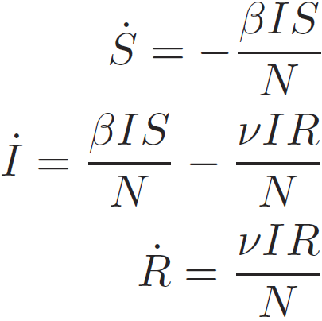

# slashdot-ai-hype

Short exploration of the rise (and fall) of hype-laden buzzwords announcing the impending domination of the world by sentient computers.

---

### Background

1. Explain about the irSIR model

2. Name references, i.e.
    - http://arxiv.org/abs/1401.4208v1
    - http://arxiv.org/abs/1608.07870v1

### Approach

The approach is to fit the normalized popularity data using the irSIR model. The fit is performed in Bayesian  fashion. Namely, a generative model is specified that completely describes the data generation process: 

- temporal evolution of the sate using ODEs, and 
- subsequent addition of a Poisson-like noise.

As the absolute scale is not known, the noise is approximated by a normal distribution whose width is proportional to the square root of the normalized popularity score. This approach has shown to be able to adequately describe the observed variability. 

**The key principle is to try to include _all_ uncertainties into prediction.**

Coupled with weak uninformative priors we obtain the _posterior predictive distribution_ of the normalized popularity. The model can also be extrapolated into the future. 

The model is implemented in the [Stan](http://mc-stan.org/) probabilistic programming language, which uses the advanced NUTS MCMC sampling algorithm.

Of course, it goes without saying that even the Bayesian approach cannot account for fitting the wrong model ;-)

### Example fits of irSIR model

Fit of Google Trends data for the [Facebook](https://trends.google.com/trends/explore?q=Facebook) and [LinkedIn](https://trends.google.com/trends/explore?q=LinkedIn) search strings.

The model is fitted to the data up to 2017-05-01. The remaining data will be used for ongoing validation. I am genuinely curious about how accurate the predictions will turn out to be.

### Related example (FOMO/FUD model)

Below is a slightly different model shown fitting to the Cryptocurrency Google Trends keyword.
The model builds upon the ideas of the irSIR model and I call it the _FOMO/FUD_ model. 

The differential evolution equations are similar to irSIR, but the SI/N and IR/N terms are replaced with S(I/N)^2 and I(R/N)^2. The square terms try to approximate the _perceived value_ of belonging to a particular sub-group modeled by Metcalfe's law.

### Main results

To-Do...
