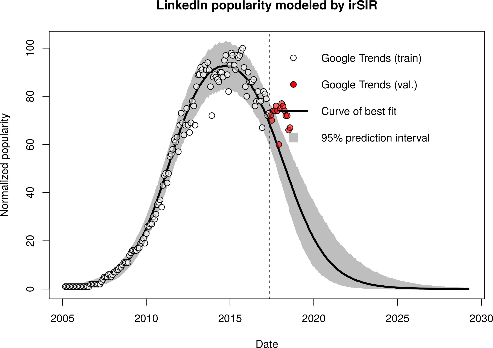

# slashdot-ai-hype

Short exploration of the rise (and fall) of hype-laden buzzwords announcing the impending domination of the world by sentient computers.

---

### Background

To-Do:

1. Explain the irSIR model

2. Cite references, i.e.
    - http://arxiv.org/abs/1401.4208v1
    - http://arxiv.org/abs/1608.07870v1

### Approach

The approach to prediction is to fit the (normalized) popularity data using the irSIR model. The fit is performed in a Bayesian fashion. Namely, a generative model is specified that completely describes the data generation process: 

- temporal evolution of the sate using ODEs, and 
- subsequent addition of a Poisson-like noise.

As the absolute scale is not known, the noise is approximated by a normal distribution whose width is proportional to the square root of the normalized popularity score. This approach has been shown to adequately describe the observed variability. 

**The key principle is to try to include _all_ uncertainties into prediction.**

Coupled with weak uninformative priors we obtain the _posterior predictive distribution_ of the normalized popularity. The model can be extrapolated into the future. 

The model is implemented in the [Stan](http://mc-stan.org/) probabilistic programming language, which uses the advanced NUTS MCMC sampling algorithm.

Of course, it goes without saying that even a Bayesian approach cannot mitigate the consequences of fitting the wrong model ;-)

### Example fits of irSIR model

Fit of Google Trends data for the [Facebook](https://trends.google.com/trends/explore?q=Facebook) and [LinkedIn](https://trends.google.com/trends/explore?q=LinkedIn) search keywords.

The model is fitted to data up to 2017-05-01. The remaining data will be used for ongoing validation. I am genuinely curious to see how accurate the predictions will turn out to be.

### Related example (FOMO/FUD model)

Below is a slightly different model shown fitting to the Cryptocurrency search keyword. The model, which I call the [FOMO](https://en.wikipedia.org/wiki/Fear_of_missing_out)/[FUD](https://en.wikipedia.org/wiki/Fear,_uncertainty_and_doubt) model, builds upon the ideas of irSIR. 

The differential equations are similar to irSIR, but the SI/N and IR/N terms are replaced with S(I/N)^2 and I(R/N)^2. The square terms approximate the _perceived value_ of belonging to a particular sub-group as modeled by [Metcalfe's law](https://en.wikipedia.org/wiki/Metcalfe%27s_law).

The fit seems quite good (much better than the irSIR fit), but the raw data is of insufficient quality. If I find the time I will write a script to obtain more precise data by querying Google Trends in shorter time periods and stitching together the results.

### Main results

To-Do...
